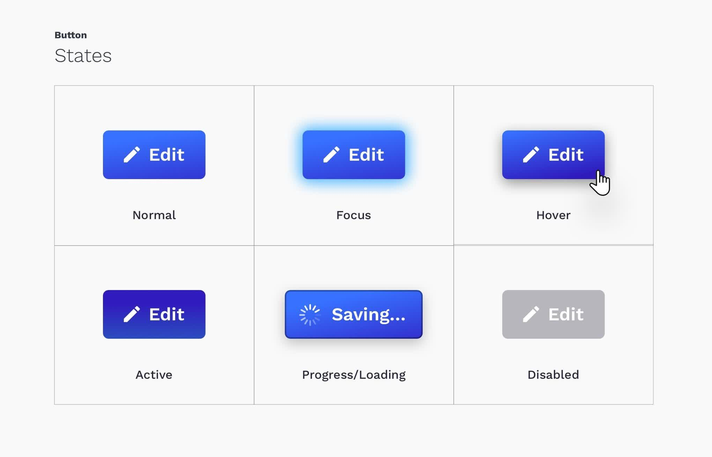

# Button 组件

### 了解按钮

按钮是后台应用中不可或缺的元素，它是一个可点击的可触发的即时操作媒介。

##### 类型

按钮按类型可以分为：常规按钮和特殊按钮。

- 常规按钮类型：

  

  1. 次按钮

     次按钮是一种常规按钮，用于非主要动作。如果不确定使用哪种按钮，次按钮永运是最安全的选择。因此，次按钮在页面中出现最为频繁。

  2. 主按钮

     在日常使用场景中，主按钮表示页面按钮区中最核心的操作，强调页面中最为核心的功能，常用于突出“完成”、“推荐”类操作。比如，新建操作、保存操作。主按钮的使用原则：

     - 一个按钮区内主按钮最好只有一个，不然会对用户的使用造成干扰。
     - 页面中并不一定需要添加主按钮。

  3. 文字按钮

     文字按钮是是一种弱化的的按钮，采用更轻量的按钮样式。它在页面中的视觉层级较低，因此可以在页面中大面积的使用，例如表格中的操作列。

  4. 图标按钮

     图标按钮提供符合视觉的直观图形，避免了阅读按钮上的文字，可以更高效地使用页面空间。图标按钮常用于页面上某块小区域需要展示几个按钮的场景。比如，页面上常见的帮助文档中心。同时，为了避免不同人对图标的理解不同，可以在用户 hover 图标按钮时提供 tooltip。

  5. 按钮中带图标

     通过图标对按钮的含义进行补充解释，从而帮助用户提高对按钮的识别效率。

- 特殊按钮类型：

  1. 危险按钮

     用于提示用户该操作存在风险，让用户谨慎思考。同时，为了避免用户误操作，一般都会提供二次确认。

  2. 幽灵按钮

     通常被置于复杂或较深的背景中，它没有复杂的颜色、样式，以避免按钮突兀地破坏背景的整体性。

  3. 虚线按钮

     用于引导用户在一个区域内添加内容，比如，上传图片、上传资料等场景。

  4. 行动号召按钮

     常出现在一些引导场景中，比如，立即购买、联系我们，多带有命令客户跟随操作的目的。

##### 状态

按钮还具有不同的状态：



- 正常状态（Normal）：按钮的正常状态。
- 聚焦状态（Focus）：按钮获得焦点，表示了鼠标在页面上处于什么位置。当用户点击或触摸元素或通过键盘的 “tab” 键选择它时会被触发。
- 悬停状态（Hover）：鼠标悬浮在按钮上时的状态，通常按钮颜色会变浅。
- 激活状态（Active）：用户点击按钮时按下鼠标的状态，通常按钮颜色会变深，鼠标被释放时通常伴随着阴影效果。
- 加载状态（Loading）：用于异步操作等待反馈的时候，同时也可避免用户多次提交。
- 禁用状态（Disabled）：按钮不可用，相应地鼠标形状也会变为禁用标示。

### 基本流程

##### 需求分析

用户使用按钮完成他们想要采取的操作，触发相应的业务逻辑。

##### UI 设计

根据按钮不同的类型和相应的状态绘制 UI。

##### 代码开发

- 用户怎么使用

  ```vue
  <template>
    <div>
      <l-button>默认按钮</w-button>
      <l-button type="primary">主要按钮</w-button>
      <l-button type="dashed">虚线按钮</w-button>
      <l-button type="text">文字按钮</w-button>
      <l-button status="danger">危险按钮</w-button>
      <l-button :loading="loading">加载状态的按钮</w-button>
      <l-button disabled>禁用状态的按钮</w-button>
      <l-button icon="setting">带有图标的按钮</w-button>
    </div>
  </template>
  ```

- props

  - type：secondary、primary、dashed、outline、text
  - size：mini、small、medium、large
  - disabled
  - status：success、warning、danger
  - icon
  - iconPosition：left、right
  - loading
  - long
  - shape：square、circle、round
  - htmlType：button、submit、reset
  
- events

  - click

##### 单元测试

程序输入参数，预期程序是正确的

- BDD 行为驱动开发
- TDD 测试驱动开发

### 知识点

##### HTML / CSS

- `<button>` 元素

  `<button>` 是 HTML 中的一个可交互式元素，用户可以使用鼠标、键盘、手指、语音命令或其它辅助工具来激活它。

- `disabled` attribute

- `:root` 伪类

- CSS 变量

- `var()` 函数使用 CSS 变量

- `border-radius`

- `:link`、`:visitied`、`:hover`、`:focus`、`:active` 伪类及其顺序

- `:focus-visible` 伪类

- CSS 动画

- `transform`

- `user-select`

##### JavaScript

- `Array.from`

##### Vue

- 开发技巧
  - 传入组件的 props 常常使用计算属性添加相应的 class 到元素上，再通过 CSS 来控制组件的样式。

- `Vue.component()` 注册全局组件
- `slot` 插槽
- `props` 接收外部传参
- `:class` 的增强
- `$emit`
- `Vue.extend()`
- `propsData`

##### 工程方面

- `npm install -S` 和 `npm install -D` 区别
- `npx` 命令
- Iconfont 的使用
