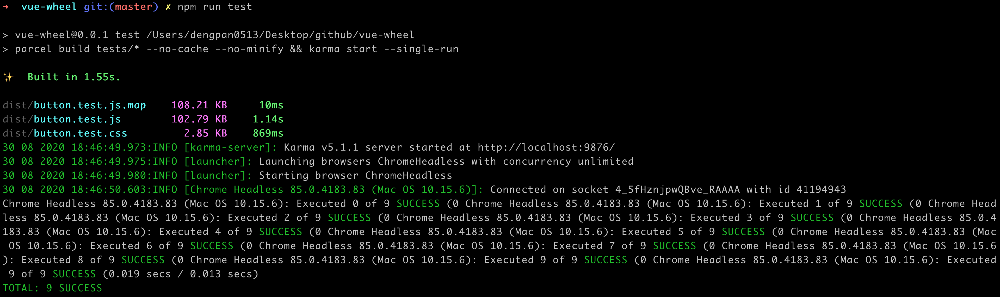
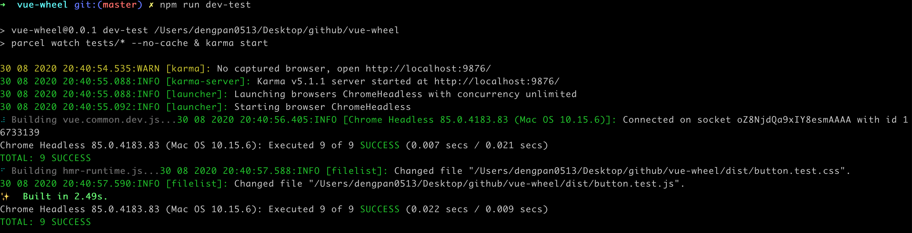
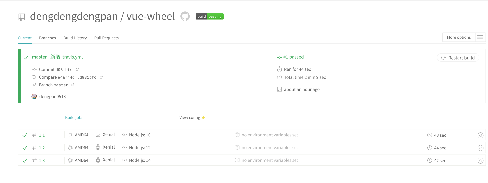

# 搭建开发框架

### 知识点

#### 自动化测试

- 背景知识

  - Karma 是一个测试运行器，可以用于打开浏览器，加载测试脚本，然后运行测试用例
  - Mocha 是一个单元测试框架，可以用它来写测试用例
  - Sinon 是一个 spy/stub/mock 库，用以辅助单元测试

- 使用 Karma + Mocha 做单元测试

  - 安装各种工具

    ```shell
    npm i -D karma karma-chrome-launcher karma-mocha karma-sinon-chai mocha sinon sinon-chai karma-chai karma-chai-spies
    ```

  - 创建 Karma 配置

    ```javascript
    module.exports = function (config) {
      config.set({
        // base path that will be used to resolve all patterns (eg. files, exclude)
        basePath: '',
    
        // frameworks to use
        // available frameworks: https://npmjs.org/browse/keyword/karma-adapter
        frameworks: ['mocha', 'sinon-chai'],
        client: {
          chai: {
            includeStack: true
          }
        },
    
        // list of files / patterns to load in the browser
        files: [
          'dist/**/*.test.js',
          'dist/**/*.test.css'
        ],
    
        // list of files / patterns to exclude
        exclude: [],
    
        // preprocess matching files before serving them to the browser
        // available preprocessors: https://npmjs.org/browse/keyword/karma-preprocessor
        preprocessors: {},
    
        // test results reporter to use
        // possible values: 'dots', 'progress'
        // available reporters: https://npmjs.org/browse/keyword/karma-reporter
        reporters: ['progress'],
    
        // web server port
        port: 9876,
    
        // enable / disable colors in the output (reporters and logs)
        colors: true,
    
        // level of logging
        // possible values: config.LOG_DISABLE || config.LOG_ERROR || config.LOG_WARN || config.LOG_INFO || config.LOG_DEBUG
        logLevel: config.LOG_INFO,
    
        // enable / disable watching file and executing tests whenever any file changes
        autoWatch: true,
    
        // start these browsers
        // available browser launchers: https://npmjs.org/browse/keyword/karma-launcher
        browsers: ['ChromeHeadless'],
    
        // Continuous Integration mode
        // if true, Karma captures browsers, runs the tests and exits
        singleRun: false,
    
        // Concurrency level
        // how many browser should be started simultaneous
        concurrency: Infinity
      })
    }
    ```

  - 创建测试文件 tests/button.test.js

    ```javascript
    import Vue from 'vue'
    import WButton from '../src/components/WButton.vue'
    
    Vue.config.productionTip = false
    Vue.config.devtools = false
    
    const expect = chai.expect
    
    describe('WButton ', () => {
      it('存在', () => {
        expect(WButton).to.be.exist
      })
    
      describe('props ', () => {
        const Constructor = Vue.extend(WButton)
        let vm
        afterEach(() => {
          vm.$destroy()
        })
    
        it('可以设置 type', () => {
          vm = new Constructor({
            propsData: {
              type: 'primary'
            }
          }).$mount()
          const className = vm.$el.className.split(' ')[1]
          expect(className).to.equal('w-button-primary')
        })
    
        it('可以设置 shape', () => {
          vm = new Constructor({
            propsData: {
              shape: 'circle'
            }
          }).$mount()
          const className = vm.$el.className.split(' ')[1]
          expect(className).to.equal('w-button-circle')
        })
    
        it('可以设置 disabled', () => {
          vm = new Constructor({
            propsData: {
              disabled: true
            }
          }).$mount()
          const disabledAttribute = vm.$el.getAttribute('disabled')
          expect(disabledAttribute).to.equal('disabled')
        })
    
        it('可以设置 icon', () => {
          vm = new Constructor({
            propsData: {
              icon: 'setting'
            }
          }).$mount()
          const useElement = vm.$el.querySelector('use')
          const xlinkHref = useElement.getAttribute('xlink:href')
          expect(xlinkHref).to.equal('#icon-setting')
        })
    
        it('未设置 iconPosition 时，svg 元素的 order 是 1', () => {
          const divElement = document.createElement('div')
          document.body.appendChild(divElement)
          vm = new Constructor({
            propsData: {
              icon: 'setting'
            }
          }).$mount(divElement)
          const svgElement = vm.$el.querySelector('svg')
          const { order } = window.getComputedStyle(svgElement)
          expect(order).to.equal('1')
          vm.$el.remove()
        })
    
        it('设置 iconPosition 为 right 时，svg 元素的 order 是 2', () => {
          const divElement = document.createElement('div')
          document.body.appendChild(divElement)
          vm = new Constructor({
            propsData: {
              icon: 'setting',
              iconPosition: 'right'
            }
          }).$mount(divElement)
          const svgElement = vm.$el.querySelector('svg')
          const { order } = window.getComputedStyle(svgElement)
          expect(order).to.equal('2')
          vm.$el.remove()
        })
    
        it('可以设置 loading', () => {
          vm = new Constructor({
            propsData: {
              icon: 'setting',
              loading: true
            }
          }).$mount()
          const svgElements = vm.$el.querySelectorAll('svg')
          expect(svgElements.length).to.equal(1)
          const useElement = vm.$el.querySelector('use')
          const xlinkHref = useElement.getAttribute('xlink:href')
          expect(xlinkHref).to.equal('#icon-loading')
        })
      })
    
      describe('事件', () => {
        it('支持 click', () => {
          const Constructor = Vue.extend(WButton)
          const vm = new Constructor({}).$mount()
          const spy = sinon.fake()
          vm.$on('click', spy)
          vm.$el.click()
          expect(spy).to.have.been.called
          vm.$destroy()
        })
      })
    })
    ```

  - 创建测试脚本，在 package.json 中的 `scripts` 添加如下内容

    ```json
    "scripts": {
      "dev-test": "parcel watch tests/* --no-cache & karma start",
      "test": "parcel build tests/* --no-cache --no-minify && karma start --single-run"
    },
    ```

  - 运行测试脚本

    - 使用 `npm run test` 一次性运行

      

    - 使用 `nom run dev-test` 进行 watch 运行

      

#### 持续集成

- 持续集成是什么？

  持续集成指的是一天多次地将代码集成到主干。在这个过程中，只要开发人员提交了新代码，就自动运行构建和测试，并反馈运行结果，在确保符合预期后，再将新代码集成到主干。

- 持续集成的好处？

  - 快速发现错误。每完成一点代码更新后，就自动进行测试，可以快速发现错误，定位错误也容易。
  - 防止分支过大难以集成。
  - 快速迭代产品，并保证产品质量。其核心措施是代码在集成到主干之前必须通过自动化测试，只要有一个测试用例失败，就不能集成到主干。

- Travis CI 就是一个提供持续集成服务的工具

  - 在 Travis 官网通过 GitHub 账号登录，然后选择所需要开启 repository

  - 在项目中创建 .travis.yml 文件

    ```yml
    language: node_js
    node_js:
      - "10"
      - "12"
      - "14"
    addons:
    chrome: stable
    sudo: required
    before_script:
      - "sudo chown root /opt/google/chrome/chrome-sandbox"
      - "sudo chmod 4755 /opt/google/chrome/chrome-sandbox"
    ```

  - 将代码上传到  GitHub 后，Travis CI 便开始进行测试，运行情况如下

    

  - 后续只要有测试提交，Travis CI 就能自动测试并可以通过邮件通知

#### 持续交付

持续交付可以看成持续集成的下一步，它指的是可以频繁地将软件的新版本交付给质量团队或用户，以供评审。

#### 持续部署

持续部署是持续交付的下一步，指的是代码通过评审后，自动部署到生产环境。

#### 发布 npm 包

- 代码测试

  对于要发布的 npm 包，应该保证代码测试都通过

- 发布包到 npm

  - package.json
    -  将版本号改为 0.0.1，第一位代表大版本改动，第二位代表小版本改动，第三位代表布丁改动
    - 在项目中创建 index.js 将其作为入口（main 字段），index.js 中导出所需内容
  - 在 npm 官网注册账户
  - 在项目中运行 `npm adduser` 登录 npm 账户 
  - 运行 `npm publish` 发布包

- 使用包

  - 别人会怎么使用
    - 使用 vue/cli
    - 使用 webpack
    - 使用 parcel
  - 分别使用以上方式来使用自己的包，以 vue/cli 为例，发现如下问题：
    - 引入组件的过程中 CSS 缺失，这是因为使用了 CSS 变量
  - 开发过程中如何在修改源码后看到最新效果
    - 更新 package.json 里的 version，然后 `npm publish`，再通过 `npm update xxx` 更新来查看最新效果
    - **在项目中运行 `npm link`，然后在使用之处运行 `npm link xxx` 就可看到最新效果**


