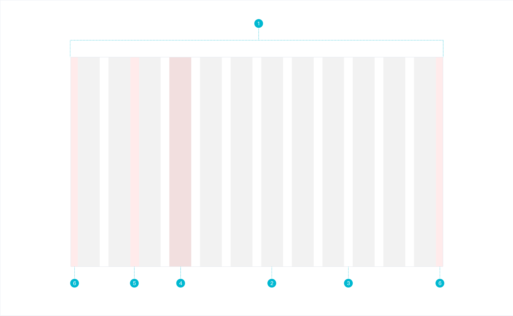

# Grid 组件

### 基本流程

##### 需求分析

- 组件定义

  栅格系统（Grid Systems）是指运用固定的格子，遵循一定的规则，进行页面的布局设计，使布局规范简洁有规则。在设计和开发中应用栅格系统可以有效的保证页面的一致性、逻辑性、加强团队协作和统一，从而提升整个设计开发流程效率。

- 组件构成

  

  其中，各部分表示如下：

  1. 页面整体宽度。
  2. 栅格（column）个数：指整体页面有多少个栅格。
  3. 水槽（gutter）个数：指整体页面有多少个水槽。
  4. 栅格宽度：指每一个栅格的宽度。
  5. 水槽宽度：指每一个水槽的宽度。
  6. 边距：指第一个栅格距离页面边框的距离。

- 组件**工作原理**

  - 通过 row 在水平方向建立一组 col（column）。
  - 将页面内容放置在 col 内，并且只有 col 可以作为 row 的直接子元素。
  - 栅格系统中的列是指 1 到 24 的值来表示其跨越范围。
  - 如果一个 row 中的 col 总和超过了 24，那么多余的列会作为一个整体另起一行排列。
  - 该栅格系统基于 Flex 布局。 

- 组件类型

  栅格系统目前有两种主流的等分方式：

  - 12 等分栅格系统：适用于业务信息分组较少，单个盒子内信息体积较大的中后台页面设计。

    

  - 24 等分栅格系统：适用于业务信息量较大，信息分组较多、单个盒子内信息体积较小的中后台页面设计。相较于 12 栅格系统，24 栅格系统变化更加灵活，更适合内容比较多样的场景设计。

    

- 组件尺寸

  - 栅格宽度：建议栅格系统的网格大小选定8作为栅格系统的原子单位，目前主流设计屏幕分辨率在水平以及垂直方向都可以被8整除，使用8作为最小原子足够适配。
  - 水槽宽度：根据业务可自定义水槽的值。比如 8、16、24、32、40 等，经过实践经验，正常情况下，水槽宽度为24时，视觉效果最佳。

- 何时使用

  在进行板式设计时：栅格系统可以辅助设计师调整内容的位置以及对齐方式，可以使内容变得规律、有序。

- 何时不使用

  非常规设计时：需要根据场景自行设计。

##### UI 设计

##### 代码开发

- 用户怎么使用

  ```vue
  <template>
    <div>
      <div class="demo1">
        <l-row>
          <l-col :span="12">12</l-col>
          <l-col :span="12">12</l-col>
        </l-row>
      </div>
      <div class="demo2">
        <l-row>
          <l-col :span="8">8</l-col>
          <l-col :span="8">8</l-col>
          <l-col :span="8">8</l-col>
        </l-row>
      </div>
      <div class="demo3">
        <l-row :gutter="20">
          <l-col :span="4">4</l-col>
          <l-col :span="20">20</l-col>
        </l-row>
      </div>
      <div class="demo4">
        <l-row>
          <l-col :span="2">4</l-col>
          <l-col :span="18" :offset="4">20</l-col>
        </l-row>
      </div>
      <div class="demo5" justify="center">
        <l-row :gutter="20">
          <l-col :span="4" :order="2">4</l-col>
          <l-col :span="20">20</l-col>
        </l-row>
      </div>
    </div>
    </div>
  </template>
  ```

- LRow 组件 props

  - gutter：栅格之间的间距，实现思路：

    - col 之间的间隔通过 `padding-right` 和 `padding-left` 来表示。之所以不使用 `margin` 是因为它会和 col 的 offset （由 `margin-left` 实现）发生冲突。

    - 由于 col 设置了左右内边距，col 和 row 之间会有间距：

      

    - 这个时候可以在父元素上（即 row）添加对应的负 `margin` 将上图中的间距“消除”掉，最终效果如下图：

      

    - 在 LRow 组件上添加 `gutter` props，并且在 LCol 组件 `created` 时候将值赋值给 WCol  data `gutterParent`。

  - justify：水平对齐。

  - align：垂直对齐。

  - wrap： 是否换行。 

- LCol 组件 props

  - span：栅格所占列数。

  - offset：栅格距离左侧的列数。

  - pull：栅格向左移动的列数。

  - push：栅格向右移动的列数。

  - order：栅格在当前 row 中的排序。

  - 响应式布局的属性有：xs、sm、md、lg、xl、xxl。
    - 响应式布局属性可以接收两种类型的值：
      1. Number 用于直接表示 span prop。例如，`:sm="6"` 表示 sm 尺寸下 span prop 的值为 6。
      2. Object 用于表示 Col 所有的 props，例如：`:sm="{ order: 2, offset: 1, push: 4 }"`。
      
    - 怎么实现响应属性？
    
      1. 响应式属性分 Number 和 Object 这两种类型将对应的 class 添加到 Col 组件的根元素上。
    
      2. 应用 `@media` 规则设置每个响应式属性的 CSS 规则。
    
      3. 用户如果只写了 xs 和 md 这两种尺寸，但屏幕刚好在 sm 尺寸内，则响应式布局自动取较小的样式——即 xs 。因此应用媒体查询时样式从上到下 `min-width` 逐渐变大。
    
         

- **在实现 props 时，在 CSS 中是无法知道 JS props 的变化。解决的方法就是将 JS props 的变化反映在 HTML attribute 中（一般是 class），然后通过 CSS 的 class 来设置不同的样式变化。**

##### 单元测试

### 知识点

##### HTML/CSS

- Grid 布局
- Flex 布局
- SCSS `for` 循环的使用
- `@media` 媒体查询

##### Vue

- 风格推荐：组件名应该是多个单词（必要的）
- `props` 类型检查
- `class` 绑定
- `style` 绑定
- `created` 钩子和 `mounted` 钩子两个的区别？它们在组件中产生顺序以及在父子组件中的产生顺序？
- `computed` 在 `created` 钩子之后，在 `mounted` 钩子之前。
- `computed` 使用场景
- 计算属性依赖其它计算属性

##### 工程方面

- `git branch` 和 `git checkout` 的使用
- 代码重构、重写区别
  - 重构：微小调整，每天都做。哪些代码需要重构？
    1. 重复两次及以上的代码。
    2. 一眼看不懂的代码。
  - 重写：大调整，隔一段时间做。

