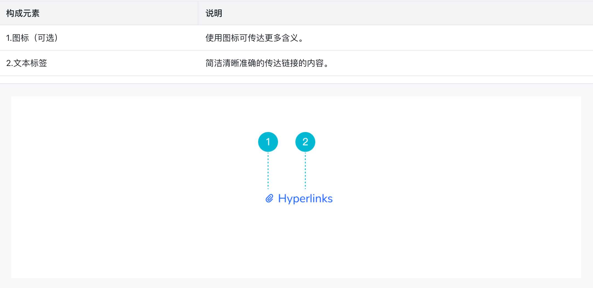

# Link 组件

### 基本流程

##### 需求分析

- 组件定义：Link 组件是具有导航属性的文本，点击后跳转到某个页面。

- 组件构成：

  - 文本标签。
  - 图标（可选）。

- 组件状态：

  - 链接状态：含有成功、警告、失败 3 种状态。
  - 链接交互状态：含有默认、悬浮、激活、禁用 4 种状态。

- 何时使用？

  当用户执行以下操作时，可以使用链接：

  - 跳转到系统中的其它页面。
  - 跳转到同一页面的其它元素。
  - 跳转到外部站点。

  链接组件的使用场景如下：

  1. 作为独立链接

     独立链接不能在句子或段落中使用。独立链接可与图标组合使用，图标放置在链接旁边，图标始终与链接文本使用相同的颜色。

  2. 作为内嵌链接

     内嵌链接用于句子或段落文本中，默认为蓝色，便于与旁边的文字区分，可使用户更加清楚地与之进行交互。内嵌链接不可单独使用，也不能和图标组合使用。

- 何时不使用？

  如果只是在当前页面触发操作或者是改变状态，应该使用按钮组件，而不是使用链接组件。

- 交互行为

  - 鼠标：用户可以通过鼠标点击链接文本来触发链接。当鼠标悬浮在链接上时，鼠标应为 pointer；当链接禁用时，鼠标应为 not-allowed。
  - 键盘：用户可以通过 tab 键对链接进行切换，并且可以通过 enter 键触发链接。

##### UI 设计



##### 代码开发

- 用户怎么使用

  ```vue
  <l-link href="www.xxx.com">新浪微博</l-link>
  <l-link href="www.xxx.com" status="success">新浪微博</l-link>
  <l-link href="www.xxx.com" disabled>新浪微博</l-link>
  ```

- props:

  - href

  - target

  - underline

  - status

  - icon

  - isHover

  - disabled

    `a` 元素不支持 `disabled` 属性，但是可以在点击 `a` 元素时通过阻止其默认行为（即跳转页面）和冒泡来模拟被禁用：

    ```javascript
    {
      methods: {
        onClick (event) {
          if (this.disabled) {
            event.preventDefault()
            event.stopPropogation()
          } else {
            this.$emit('click', event)
          }
        }
      }
    }
    ```

- events：

  - click

- 单元测试

##### 单元测试

### 知识点

##### HTML/CSS

- tabindex
- :link
- :visited
- :not

##### JavaScript

- event.preventDefault()
- event.stopPropagation()
