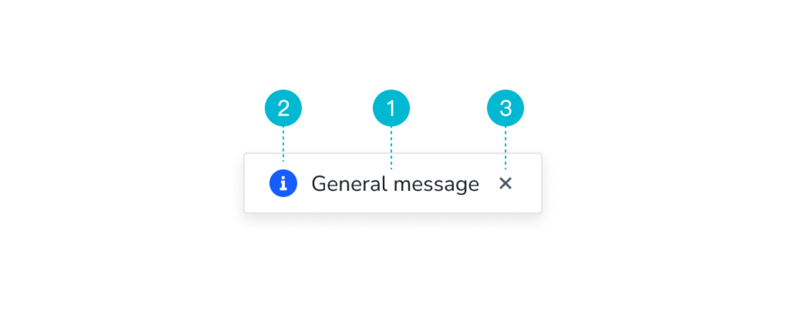

# Message 组件

### 基本流程

##### 需求分析

- 组件定义：由用户的操作触发的轻量级全局反馈。

- 组件构成：

  1. 文本（必选）：用以提供对应操作的反馈信息。
  2. 图标（可选）：用以提供对应文本信息的图标。
  3. 关闭按钮（可选）：根据实际情况，选择是否有关闭按钮。

  

- 组件类型：Message 组件有以下 5 种类型。

  1. 指南提示：用于传达加载、帮助、指南信息。
  2. 普通提示：用于传达辅助类信息。
  3. 成功提示：用于传达成功或积极的信息。
  4. 警告提示：用于传达警示或提醒的信息。
  5. 失败提示：用于传达失败或错误的信息提示。

  

- 组件状态：可分为默认状态和加载状态。

  

- 何时使用

  在用户进行某些操作后，用以提供相应的轻量级反馈信息，例如：成功、失败、警告等。

##### UI 设计

##### 代码开发

- 用户怎么使用：

  ```vue
  <template>
    <button @click="handleConfirm">确定</button>
  </template>
  
  <script>
  export default {
    // ...
    methods: {
      handleConfirm () {
        this.$message('验证失败')
        this.$message('验证失败', 10)
      },
      handleSuccess () {
        this.$message({
          type: 'success',
          content: '修改成功',
          onClose () {
            // do something
          }
        })
      },
      handleError () {
  			this.$message({
          type: 'error',
          content: '提交失败'
        })
      }
    }
  }
  </script>
  ```

- props:

  - content
  - dangerouslyUseHTML
  - duration
  - type
  - top
  - icon
  - closeable
  - onClose
  
- methods:

- - `this.$message(content, [duration], onClose)` 此时 Message 组件类型等同于 `normal`

  - `this.$message.info(content, [duration], onClose)`
  - `this.$message.success(content, [duration], onClose)`
  - `this.$message.warning(content, [duration], onClose)`
  - `this.$message.error(content, [duration], onClose)`
  - `this.$message.loading(content, [duration], onClose)`
  
- 怎么实现 `this.$message` 的使用方法？

  通过以插件的方式添加 Vue 实例方法。

  ```javascript
  export default {
    install (Vue) {
      Vue.prototype.$message = (content, duration, onClose) => {
        //
      }
    }
  }
  ```

  然后在 `new Vue()` 之前通过全局方法 `Vue.use()` 使用该插件：

  ```javascript
  import MessagePlugin from '~/Message/plugin.js'
  
  Vue.use(MessagePlugin)
  
  new Vue({
    //
  })
  ```

- 怎么通过 Vue 组件来动态创建实例？

  1. 通过全局方法 `Vue.extend()` 创建构造函数。
  2. 使用构造函数创建实例。
  3. 通过 Vue 实例方法 `vm.$mount()` 将实例添加到内存中。
  4. 通过 JS 原生方法将实例添加到 DOM 上。

  代码如下：

  ```javascript
  const MessageConstructor = Vue.extend(Message)
  const MessageInstance = new MessageConstructor({})
  MessageInstance.$mount()
  document.body.appendChild(MessageInstance.$el)
  ```

- 怎么实现 Message 组件进入/离开的过渡效果？

  1. 在 Message 组件的根元素上设置 `<transition>` 用以添加过渡效果。

     ```vue
     <template>
       <transition name="l-message-slide"></transition>
     </template>
     
     <style>
     .l-message-slide-enter, .l-message-slide-leave-to {
       opacity: 0;
       transform: translateY(-100%);
     }
     .l-message-slide-enter-active {
       transition: all .3s;
     }
     .l-message-slide-leave-active {
       transition: all .2s;
     }
     </style>
     ```

  2. 在 Message 组件的根元素上添加 `v-show` 用以触发 `transition` 的过渡效果。

- 怎么实现页面上多个 Message 竖着排列效果？

  一、假设 Message 都不会被关闭，思路如下：

  1. 先获取第一个 Message 距离页面顶部的距离。

     ```javascript
     let top = message.top
     ```

  2. 遍历 `messageInstances` 中所有的实例，将上面得到的 `top` 加上每个实例的 `offsetHeight` 和垂直方向的间隔值。 

     ```javascript
     messageInstances.forEach(instance => {
       const { offsetHeight } = instance
       top += offsetHeight + gapVertical
     })
     ```

  3. 将遍历后计算得出的 top 赋值给当前创建的实例。

     ```javascript
     messageInstance.top = top
     ```

  4. 将新创建的实例添加到 `messageInstances` 中。

     ```javascript
     messageInstances.push(messageInstance)
     ```

  二、考虑 Message 会被关闭的情况，思路如下：

  当 Message 实例关闭时，应当将其从 `messageInstances` 数组中移除。为此：

  1. 需要给实例添加 id——作为唯一标识。

     ```javascript
     messageInstance.id = `l-message-${count++}`
     ```

  2. 需要在实例关闭时 emit 事件，便于在实例中进行监听。

     ```javascript
     messageInstance.$on('close', (currentInstance) => {
       // ...
     })
     ```

  3. 遍历 `messageInstances` 找到和当前关闭的实例具有相同 id 的项，记录当前它在实例数组中的 index 以及自身高度，并将它从 `messageInstances` 中删除。

     ```javascript
     messageInstance.$on('close', (currentInstance) => {
       let index = -1
       let heightRemoved = 0
       // 找到被关闭的实例
       messageInstances.forEach((instance, i) => {
         if (instance.id === currentInstance.id) {
           index = i
           messageList.splice(i, 1)
           heightRemoved = currentInstance.$el.offsetHeight
         }
       })
     })
     ```

  4. 重新计算在 `mesageInstances` 中位于关闭实例之后的项。

     ```javascript
     messageInstance.$on('close', (currentInstance) => {
       let index = -1
       let heightRemoved = 0
       messageInstances.forEach((instance, i) => {
         if (instance.id === currentInstance.id) {
           index = i
           messageList.splice(i, 1)
           heightRemoved = currentInstance.$el.offsetHeight
         }
       })
       const length = messageInstances.length
       // 这两种情况不用在做后续操作
       // 1.实例数组只有 1 个或 0 个时且被关闭的不是实例数组中的第一个
       // 2.当前关闭的实例是最后一个
       if ((length <= 1 && index !== 0) || index > length - 1) {
         return
       }
       // 被关闭的后面的所有实例都要修改 top
       for (let i = index; i < count; i++) {
         const rootElement = messageInstances[i].$el
         const { style: { top } } = rootElement
         const topValue = parseInt(top, 10)
         messageInstances[i].top = topValue - height - gapVertical
       }
     })
     ```
  
- 在 Message 关闭时，位于其后的 Message top 值会发生改变，此时也应该增加过渡效果。

  ```css
  // 根元素上
  .l-message-wrapper {
    transition: all .3s;
  }
  ```

##### 单元测试


### 知识点

##### CSS

- `min-height` 不是真实高度，父元素设置 `min-height: 100px`，子元素设置 `height: 100%`，此时子元素的真实高度不存在。
- `pointer-events`
- `transition`
- `transform`

##### JavaScript

- `getBoundingRect()`
- `offsetHeight`
- `remove()`

##### Vue

- 插件

  插件通常是用来为 Vue 添加全局功能，一般有以下几种：

  1. 添加全局属性或方法。
  2. 添加全局资源：指令、过滤器、过渡等。
  3. 通过全局混入添加一些组件选项。
  4. 添加 Vue 实例方法，通过在 `Vue.prototype` 上添加方法实现。

  **开发插件**：Vue 插件的开发应该始终暴露一个 `install` 函数——它可以作为一个对象的方法，也可以直接作为一个函数。在这两种情况下参数都是一致的，第一个参数是 Vue 构造器，第二个参数是一个可选的选项对象。

  ```javascript
  export default {
    install (Vue, options) {
      // 1.全局属性或方法
      Vue.appName = 'lt-ui'
      Vue.globalMethod = () => {
        //
      }
      
      // 2.添加全局资源
      Vue.directive('v-validate-btn', {
        bind (el, binding, vnode, oldVnode) {
          //
        }
      })
      
      // 3.通过 Vue.mixin 注入组件选项
      Vue.mixin({
        //
      })
      
      // 4.通过 Vue.prototype 添加实例方法
      Vue.prototype.$message = () => {
        //
      }
    }
  }
  ```

  **使用组件**：通过全局方法 `Vue.use()` 使用插件，不过需要在调用 `new Vue()` 启动应用之前完成。

  ```javascript
  Vue.use(MessagePlugin)
  
  new Vue({
    //
  })
  ```

- `Vue.extend()`

  使用基础 Vue 构造器，创建一个“子类”。其中参数是一个包含组件选项的对象。

  ```javascript
  import Message from './Message.vue'
  const MessageConstructor = Vue.extend(Message);
  ```

- `vm.$mount()`

  如果 Vue 实例在实例化时没有收到 `el` 选项，则该实例处于“未挂载”状态，没有关联的 DOM 元素。此时，可以使用 `vm.$mount()` 手动地挂载一个未挂载的实例。

  如果使用 `vm.$mount()` 时未提供参数，模板将被渲染为文档之外的元素（存在于内存中）。要想将其显示到页面上，必须使用原生 DOM API 将其插入文档中。

  `vm.$mount()` 方法返回实例自身，因而可以链式调用其它实例方法。

  ```javascript
  const messageInstance = new MessageConstructor();
  
  // 挂载到 #app，此时会替换掉 #app
  messageInstance.$mount('#app');
  // 同上
  new MessageConstructor({ el: '#app' });
  
  // 先在内存中创建，然后手动挂载
  messageInstance.$mount();
  document.body.appendChild(messageInstance.$el);
  ```

- `<transition>`