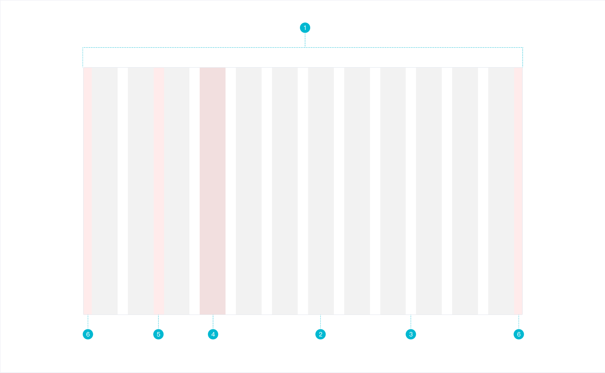

# Row/Col 栅格系统

### 认识栅格系统

栅格系统是指使用固定的格子进行网页布局，常采用 24 栅格系统。



### 基本流程

1. 需求分析

   - 通过 `w-row` 在水平方向建立一个或多个列，`w-row` 的直接子元素只能是`w-col`，而页面内容应该放在 `w-col` 内。
   - 栅格系统的列使用 1～24 来表示其范围。
   - 如果一行中列的总和超过了 24，则多余的列会作为一个整体另起一行。
   - 该栅格系统基于 Flex 布局。

2. UI 设计

3. 代码开发

   - 用户怎么使用组件：

     ```vue
     <template>
       <w-row gutter="10">
         <w-col span="12">111</w-col>
         <w-col span="12">222</w-col>
       </w-row>
     </template>
     ```

   - `WRow` 组件 props：`gutter`、`justify`、`align`、`wrap`

   - `WCol` 组件 props：`span`、`offset`、`order`、`pull`、`push`

4. 单元测试

   `WRow` 和 `WCol` 两个组件的 props。

##### 单元测试

### 知识点

##### CSS

- Grid 布局
- Flex 布局
- SCSS `for` 循环的使用
- `@media` 媒体查询的使用

##### Vue

- 风格推荐：组件名应该是多个单词（必要的）
- `props` 类型检查
- `class` 绑定
- `style` 绑定
- `created` 钩子和 `mounted` 钩子两个的区别？它们在组件中产生顺序以及在父子组件中的产生顺序？
- `computed` 使用场景

##### 代码相关

- `git branch` 和 `git checkout` 的使用
- 代码重构、重写区别

