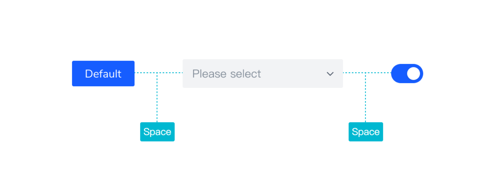
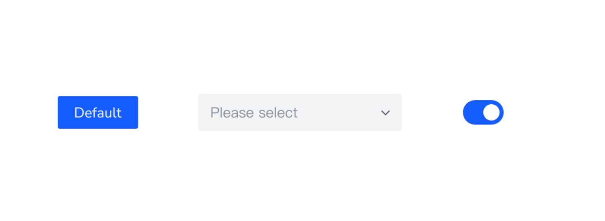
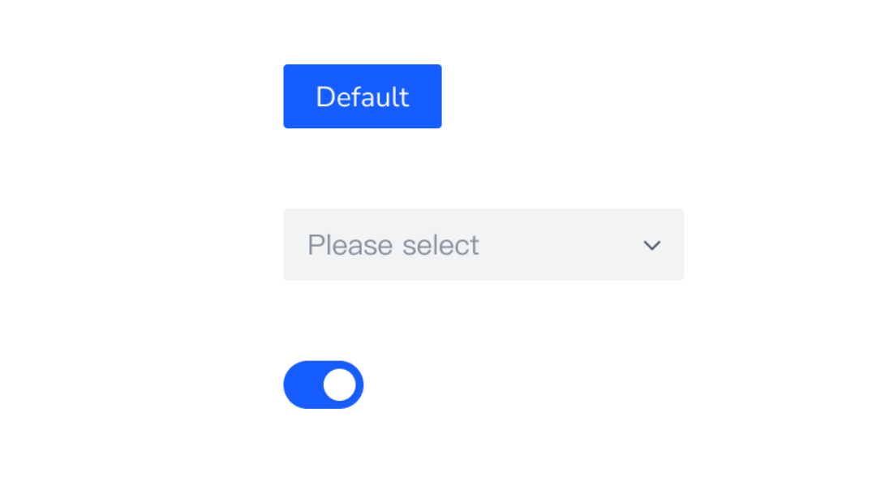
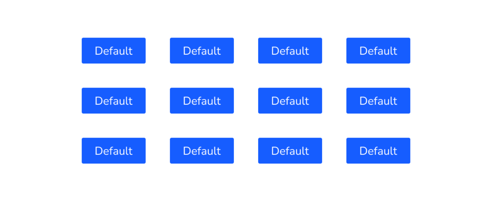

# Space 组件

### 基本流程

##### 需求分析

- 组件定义：间距组件用于设置组件之间的间距，合理的间距能使页面有清晰、使用的布局。

  

- 组件类型

  - 水平间距：相邻组件的水平间距。

    

  - 垂直间距：相邻组件的垂直间距。

    

  - 环绕间距：组件四周都有间距，一般用于换行场景。

    

- 组件尺寸

  - 迷你间距：组件之间的间距为 4px。
  - 小间距：组件之间的间距为 8px。
  - 中间距：组件之间的间距为 16px。
  - 大间距：组件之间的间距为 24px。

- 何时使用

  组件之间需要应用间距或者需要在组件间距之间使用特殊标记。

##### UI 设计

##### 代码开发

- 用户怎么使用

  ```html
  <l-space>
    <l-button>按钮 1</l-button>
    <l-button>按钮 2</l-button>
  </l-space>
  
  <l-space direction="vertical">
    <l-button>按钮 1</l-button>
    <l-button>按钮 2</l-button>
  </l-space>
  
  <l-space size="large">
    <l-button>按钮 1</l-button>
    <l-button>按钮 2</l-button>
  </l-space>
  
  <l-space align="center">
    <l-button>按钮 1</l-button>
    <l-button>按钮 2</l-button>
  </l-space>
  
  <l-space wrap>
    <l-button>按钮 1</l-button>
    <l-button>按钮 2</l-button>
  </l-space>
  ```

- props

  - direction
  - size
  - align
  - wrap
  - fill
  - split

- slot

  - split

##### 单元测试

### 知识点

##### CSS

- gap in flexbox

##### Vue

- render()
- slot