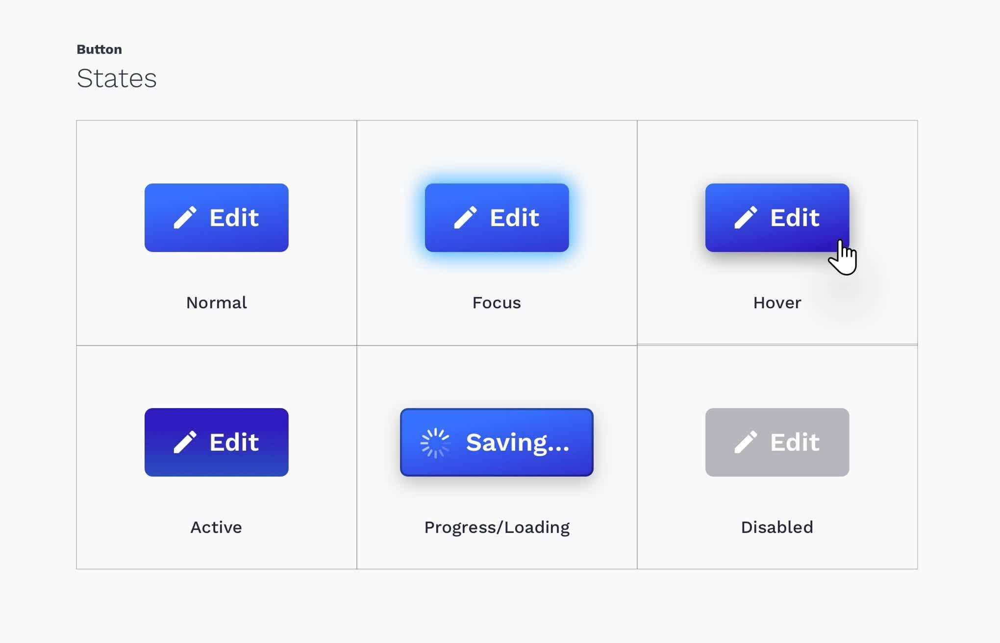

# WButton 组件

### 基本流程

##### 需求分析

用户使用按钮完成他们想要采取的行动。按钮按类型可以分为：常规按钮和特殊按钮。

常规按钮类型：


- 次按钮

  次按钮是一种常规按钮，用于非主要动作。如果不确定使用哪种按钮，次按钮永运是最安全的选择。因此，次按钮在页面中出现最为频繁。

- 主按钮

  在日常使用场景中，主按钮表示页面按钮区中最核心的操作，常用于突出“完成”、“推荐”类操作。比如，新建操作、保存操作。主按钮的使用原则，首先是一个按钮区内主按钮最好只有一个，不然会对用户的使用造成干扰；其次，页面中并不一定需要添加主按钮。

- 文字按钮

  文字按钮是是一种弱化的的按钮。它在页面中的视觉层级较低，因此可以在页面中大面积的使用，常见的使用场景是表格中的操作列。

- 图标按钮

  图标按钮提供符合视觉的直观图形，避免了阅读按钮上的文字，可以更高效地使用页面空间。图标按钮常用于页面上某块小区域需要展示几个按钮的场景。比如，页面上常见的帮助文档中心。同时，为了避免不同人对图标的理解不同，可以在用户 hover 图标按钮时提供 tooltip。

- 按钮中带图标

  可以对按钮的含义进行补充解释，帮助用户提高对按钮的识别效率。

特殊按钮类型：

- 危险按钮

  用于提示用户该操作会存在风险，让用户谨慎思考。同时，为了避免用户误操作，一般都会提供二次确认。

- 幽灵按钮

  通常被置于复杂或较深的背景中，它没有复杂的颜色、样式，以避免按钮突兀地破坏背景的整体性。

- 虚线按钮

  用于引导用户在一个区域内添加内容，比如，上传图片、上传资料等场景。

- 行动号召按钮

  常出现在一些引导场景中，比如，立即购买、联系我们，多带有命令客户跟随操作的目的。

按钮除了上述的类型之分，它还具有不同的状态：



- 正常状态（Normal）：按钮的正常状态。
- 聚焦状态（Focus）：按钮获得焦点，表示了鼠标在页面上处于什么位置。当用户点击或触摸元素或通过键盘的 “tab” 键选择它时会被触发。
- 悬停状态（Hover）：鼠标悬浮在按钮上时的状态，通常按钮颜色会变浅。
- 激活状态（Active）：用户点击按钮时按下鼠标的状态，通常按钮颜色会变深，鼠标被释放时通常伴随着阴影效果。
- 加载状态（Loading）：用于异步操作等待反馈的时候，同时也可避免用户多次提交。
- 禁用状态（Disabled）：按钮不可用，相应地鼠标形状也会变为禁用标示。

##### UI 设计

根据按钮不同的类型和相应的状态绘制 UI。

##### 代码开发

- 用户怎么使用

  ```vue
  <template>
    <div>
      <w-button>默认按钮</w-button>
      <w-button type="primary">主要按钮</w-button>
      <w-button type="dashed">虚线按钮</w-button>
      <w-button type="text">文字按钮</w-button>
      <w-button danger>危险按钮</w-button>
      <w-button :loading="loading1">加载状态的按钮</w-button>
      <w-button disabled>禁用状态的按钮</w-button>
      <w-button icon="setting">带有图标的按钮</w-button>
    </div>
  </template>
  ```

- `props`

  - `type`：`default`、`primary`、`dashed`、`text`、`link`
  - `success`：`false`、`true`
  - `warning`：`false`、`true`
  - `danger`：`false`、`true`
  - `ghost`: `false` 、`true`
  - `loading`：`false`、`true`
  - `disabled`：`false`、`true`
  - `shape`：`circle`、`round`
  - `icon`
  - `iconPosition`：`left`、`right`
  - `href`
  - `target`
  - `block`
  - `htmlType`

##### 单元测试

程序输入参数，预期程序是正确的

- BDD 行为驱动开发
- TDD 测试驱动开发

### 知识点

##### HTML / CSS

- `<button>` 元素
- `:root` 伪类
- CSS 变量
- `var()` 函数使用 CSS 变量
- `border-radius`
- `:link`、`:visitied`、`:hover`、`:focus`、`:active` 伪类
- CSS 动画
- `transform`

##### JavaScript

- `Array.from`

##### Vue

- `Vue.component()` 注册全局组件
- `slot` 插槽
- `props` 接收外部传参
- `:class` 的增强
- `$emit`
- `Vue.extend()`
- `propsData`

##### 工程方面

- `npm install -S` 和 `npm install -D` 区别
- `npx` 命令
- Iconfont 的使用
