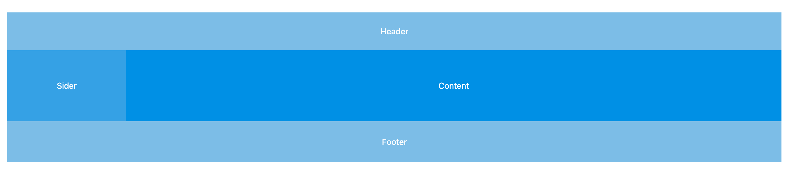

# Layout 基本布局

### 基本流程

##### 需求分析

使用 `w-layout`、`w-header`、`w-sider`、`w-content`、`w-footer` 这些布局组件协助进行页面整体布局：

- `w-layout`：布局容器， `w-layout`、`w-header`、`w-sider`、`w-content`、`w-footer` 都可以作为其子组件，可以放在任何父容器中。
- `w-header`：顶部布局，自带默认样式，其下可嵌套任何元素，其父容器只能是 `w-layout`。顶部布局高度的范围计算公式：`48+8n`。
- `w-sider`：侧边栏，自带默认样式，其下可嵌套任何元素，其父容器只能是 `w-layout`。侧边栏宽度的范围计算公式：`200+8n`。
- `w-content`：内容部分，自带默认样式，其下可嵌套任何元素，其父容器只能是 `w-layout`。
- `w-footer`：底部布局，自带默认样式，其下可嵌套任何元素，其父容器只能是 `w-layout`。

以上这些布局组件都采用 Flex 布局实现。

##### UI 设计

常见的基本布局如下：





##### 代码开发

- 用户怎么使用：

  ```vue
  <template>
    <div>
      <w-layout>
        <w-header>header</w-header>
        <w-content>content</w-content>
        <w-footer>footer</w-footer>
      </w-layout>
      
      <w-layout>
        <w-header>header</w-header>
        <w-layout>
          <w-sider>sider</w-sider>
          <w-content>content</w-content>
        </w-layout>
        <w-footer>footer</w-footer>
      </w-layout>
      
      <w-layout>
        <w-header>header</w-header>
        <w-layout>
          <w-content>content</w-content>
          <w-sider>sider</w-sider>
        </w-layout>
        <w-footer>footer</w-footer>
      </w-layout>
      
      <w-layout>
        <w-sider>sider</w-sider>
        <w-layout>
          <w-header>header</w-header>
          <w-content>content</w-content>
          <w-footer>footer</w-footer>
        </w-layout>
      </w-layout>
    </div>
  </template>
  ```

- WHeader 组件 props：
  - `height`：默认是 `64px`
- WSider 组件 props：
  - `width`：默认是 `200px`
  - `collapsible`：侧边栏可收缩
- WFooter 组件 props：
  - `height`

##### 单元测试

### 知识点

##### Vue

- 动画


