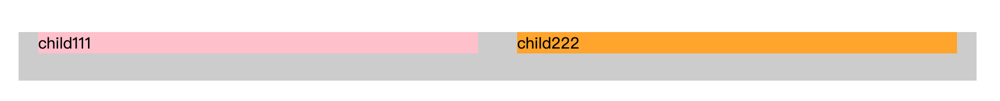
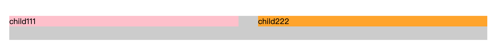

# 栅格系统

### 基本流程

##### 需求分析

栅格系统是指使用固定的格子进行网页布局，常采用 24 栅格系统，如下图：


栅格系统的工作原理是：

- 通过 `row` 在水平方向建立一组 `col`（`column`）。
- 将页面内容放置在 `col` 内，并且只有 `col` 可以作为 `row` 的直接子元素。
- 栅格系统中的列是指 1 到 24 的值来表示其跨越范围。
- 如果一个 `row` 中的 `col` 总和超过了 24，那么多余的列会作为一个整体另起一行排列。
- 该栅格系统基于 Flex 布局。 

##### UI 设计

##### 代码开发

- 用户怎么使用

  ```vue
  <template>
    <div>
      <div class="demo1">
        <w-row>
          <w-col :span="12">12</w-col>
          <w-col :span="12">12</w-col>
        </w-row>
      </div>
      <div class="demo2">
        <w-row>
          <w-col :span="8">8</w-col>
          <w-col :span="8">8</w-col>
          <w-col :span="8">8</w-col>
        </w-row>
      </div>
      <div class="demo3">
        <w-row :gutter="20">
          <w-col :span="4">4</w-col>
          <w-col :span="20">20</w-col>
        </w-row>
      </div>
      <div class="demo4">
        <w-row>
          <w-col :span="2">4</w-col>
          <w-col :span="18" :offset="4">20</w-col>
        </w-row>
      </div>
      <div class="demo5" justify="center">
        <w-row :gutter="20">
          <w-col :span="4" :order="2">4</w-col>
          <w-col :span="20">20</w-col>
        </w-row>
      </div>
    </div>
    </div>
  </template>
  ```

- WRow 组件 props：

  - `gutter` 实现思路：

    - col 之间的间隔通过 `padding-right` 和 `padding-left` 来表示。而不使用 `margin` 的原因是它会和 WCol 的 `offset` （通过 `margin-left`）发生冲突。

    - 由于 col 设置了左右内边距，col 和 row 之间会有间距，如下图：

      

    - 这个时候可以在父元素上（即 row）添加对应的负 `margin` 将上图中的间距“消除”掉，最终效果如下图：

      

    - 在 WRow 组件上添加 `gutter` props，并且在 WCol 组件 `created` 时候将值赋值给 WCol  data `gutterParent`。

  - `justify`

  - `align`

- `WCol` props：

  - `span`
  - `offset` 距离左侧的列数
  - `pull` 通过将元素向左移动改变元素在 row 中的位置
  - `push` 将元素向右移动将改变元素在 row 中的位置
  - `order`
  - 响应式布局的属性 `xs`、`sm`、`md`、`lg`、`xl`、`xxl`
    - 响应式布局属性 props 可以接收两种类型的值：
      - 一种是 Number 用于直接表示 `span` props。
      - 另一种是 Object 用于表示其它的 props，比如：`:sm="{ order: 2, offset: 1, push: 4 }"`。
    - 用户只写了`xs` 和 `md` 这两种屏幕尺寸，但屏幕刚好在 `sm`尺寸内，此时，我们的响应式布局自动取较小的样式——即 `xs` 。

- **在实现 props 时，在 CSS 中是无法知道 JS props 的变化。解决的方法就是将 JS props 的变化反映在 HTML attribute 中（一般是 class），然后通过 CSS 的 class 来设置不同的样式变化。**

##### 单元测试

### 知识点

##### HTML/CSS

- Grid 布局
- Flex 布局
- SCSS `for` 循环的使用
- `@media` 媒体查询的使用

##### Vue

- 风格推荐：组件名应该是多个单词（必要的）
- `props` 类型检查
- `class` 绑定
- `style` 绑定
- `created` 钩子和 `mounted` 钩子两个的区别？它们在组件中产生顺序以及在父子组件中的产生顺序？
- `computed` 使用场景

##### 工程方面

- `git branch` 和 `git checkout` 的使用
- 代码重构、重写区别

